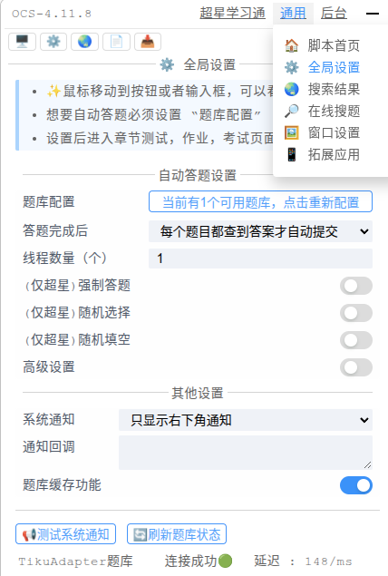

# OCS网课助手之AI自动刷题

使用[OCS](https://docs.ocsjs.com/docs/quickly-start)刷课时有些课程题目较多且没有现成题库，所以需要AI自动刷题，本项目为本地部署AI后端，免费刷题，解放劳动力。

## 环境要求

- 安装[OCS](https://docs.ocsjs.com/docs/quickly-start)脚本
- 一个公网可以访问到的地址(ip/域名)
- 一张可以足够运行大模型的显卡（实测，qwen3-4B可以在4090上运行，少数题目会出错，等全部刷完后再手动矫正即可）

## 使用方法

克隆本项目并配置环境

```bash
git clone git@github.com:Guo-Chenxu/ocs-tiku.git
cd ocs-tiku

conda create -n ocs-tiku python=3.10
pip install -r requirements.txt
```

启动后端

```bash
python app.py
```

如果一切正常的话，现在服务应该正确启动在9999端口，并且成功加载模型，接下来是在ocs中进行配置。

打开OCS页面，“通用”->“全局设置”->“题库配置”



在“题库配置”中添加如下格式的json配置，其中url替换为你自己的公网地址，然后“保存配置”即可。

```json
[
    {
        "name": "TikuAdapter题库",
        "url": "https://cxtiku.bupt-hpc.cn/api/search", // 这里替换成你自己的公网地址
        "homepage": "https://github.com/Guo-Chenxu/ocs-tiku",
        "method": "post",
        "type": "GM_xmlhttpRequest",
        "contentType": "json",
        "headers": {},
        "data": {
            "question": "${title}",
            "options": {
                "handler": "return (env)=>env.options?.split('\\n')"
            }
        },
        "handler": "return (res)=>res.answer.allAnswer.map(i=>([res.question,i.join('#')]))"
    }
]
```


## 致谢

- [OCS](https://docs.ocsjs.com/docs/quickly-start)
- [tikuAdapter](https://github.com/DokiDoki1103/tikuAdapter)

